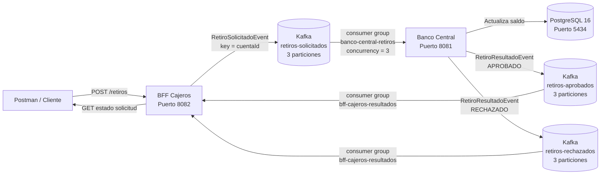

# Backend III - Semana 7

## Configuración de tolerancia a fallos y arquitectura de eventos con microservicios

Proyecto desarrollado para la asignatura **Desarrollo Backend III (PBY2203)**.

Durante esta semana se extiende la arquitectura de microservicios implementada previamente, incorporando:

- Arquitectura orientada a eventos.
- Mensajería asíncrona con Apache Kafka.
- Procesamiento paralelo mediante particiones y grupos de consumidores.
- Tolerancia a fallos con Resilience4j.
- Persistencia con PostgreSQL.
- Configuración centralizada con Spring Cloud Config.
- Descubrimiento de servicios con Eureka.
- Autenticación mediante JWT/OAuth2.

---

## 1. Objetivo

El objetivo del proyecto es implementar una arquitectura backend resiliente y orientada a eventos para el procesamiento de retiros bancarios.

El flujo permite que el BFF de cajeros reciba una solicitud de retiro y la publique de manera asíncrona en Kafka. Banco Central consume el evento, procesa la transacción en PostgreSQL y publica el resultado en un tópico de retiros aprobados o rechazados.

El BFF consume posteriormente el resultado y permite consultar el estado de la solicitud utilizando un identificador único.

También se implementan mecanismos de tolerancia a fallos con Resilience4j para controlar errores cuando Banco Central no se encuentra disponible.

---

## 2. Arquitectura seleccionada

Se utiliza una **arquitectura orientada a eventos (Event-Driven Architecture)** basada en el patrón **Publish/Subscribe**.

Apache Kafka actúa como broker de mensajería entre los componentes.

El procesamiento de retiros no requiere que el BFF espere a que Banco Central finalice la transacción. En su lugar:

1. El BFF valida previamente el usuario y la cuenta.
2. Genera un identificador único para la solicitud.
3. Publica un evento `RetiroSolicitadoEvent`.
4. Banco Central consume el evento.
5. Procesa el retiro.
6. Publica un `RetiroResultadoEvent`.
7. El BFF consume el resultado.
8. El cliente puede consultar posteriormente el estado de la solicitud.

No se implementa Saga ni Event Sourcing en esta solución. El patrón seleccionado corresponde a arquitectura orientada a eventos con publicación y suscripción.

---

## 3. Diagrama de arquitectura



---

## 4. Tópicos Kafka

La solución utiliza tres tópicos.

| Tópico | Productor | Consumidor | Evento |
|---|---|---|---|
| `retiros-solicitados` | BFF Cajeros | Banco Central | `RetiroSolicitadoEvent` |
| `retiros-aprobados` | Banco Central | BFF Cajeros | `RetiroResultadoEvent` |
| `retiros-rechazados` | Banco Central | BFF Cajeros | `RetiroResultadoEvent` |

Cada tópico utiliza **3 particiones**.

El identificador de cuenta se utiliza como key del mensaje para mantener los eventos de una misma cuenta en la misma partición.

---

## 5. Eventos

### RetiroSolicitadoEvent

```text
solicitudId
cuentaId
monto
fechaSolicitud
```

Ejemplo conceptual:

```json
{
  "solicitudId": "6a433318-ae23-4ca9-9c56-2c3aba8b99a4",
  "cuentaId": 1,
  "monto": 500.00,
  "fechaSolicitud": "2026-09-22T17:46:14Z"
}
```

### RetiroResultadoEvent

```text
solicitudId
cuentaId
estado
monto
saldoInicial
saldoFinal
motivo
fechaProcesamiento
```

Ejemplo aprobado:

```json
{
  "solicitudId": "6a433318-ae23-4ca9-9c56-2c3aba8b99a4",
  "cuentaId": 1,
  "estado": "APROBADO",
  "monto": 500.00,
  "saldoInicial": 10500.00,
  "saldoFinal": 10000.00,
  "motivo": "Retiro procesado correctamente"
}
```

Ejemplo rechazado:

```json
{
  "solicitudId": "79e27418-8254-467d-b7d1-45195399184a",
  "cuentaId": 1,
  "estado": "RECHAZADO",
  "monto": 20000.00,
  "saldoInicial": null,
  "saldoFinal": null,
  "motivo": "Fondos insuficientes para realizar esta operación"
}
```

---

## 6. Procesamiento paralelo y escalabilidad

El tópico `retiros-solicitados` utiliza tres particiones.

Banco Central configura el listener Kafka con:

```text
concurrency = 3
```

Por lo tanto se crean tres consumidores dentro del grupo:

```text
banco-central-retiros
```

Kafka distribuye las particiones entre ellos, permitiendo que distintas cuentas puedan procesarse en paralelo.

El BFF también utiliza tres consumidores para los tópicos de resultados mediante el grupo:

```text
bff-cajeros-resultados
```

La distribución observada durante las pruebas fue equivalente a:

```text
Consumer 1 -> partición 0
Consumer 2 -> partición 1
Consumer 3 -> partición 2
```

Esto permite escalar el procesamiento agregando particiones y consumidores según la carga del sistema.

---

## 7. Tolerancia a fallos con Resilience4j

El BFF utiliza Resilience4j para proteger las llamadas síncronas realizadas hacia Banco Central.

Se utilizan:

- Circuit Breaker.
- Retry.
- Fallback.
- Rate Limiter.

### Retry

Cuando Banco Central no se encuentra disponible, el BFF reintenta la operación antes de devolver el error al cliente.

Configuración:

```properties
resilience4j.retry.instances.bancoCentral.max-attempts=3
resilience4j.retry.instances.bancoCentral.wait-duration=1000ms
```

Durante la prueba se observaron eventos:

```text
Retry bancoCentral intento #1
Retry bancoCentral intento #2
```

### Fallback

Cuando la comunicación falla se activa un método fallback.

El cliente recibe:

```text
503 Service Unavailable
```

Ejemplo:

```json
{
  "mensaje": "El servicio no está disponible en este momento. Intenta más tarde"
}
```

### Circuit Breaker

Durante las pruebas se detuvo intencionalmente Banco Central.

Se observaron las siguientes transiciones:

```text
CLOSED -> OPEN
OPEN -> HALF_OPEN
HALF_OPEN -> CLOSED
```

El comportamiento demuestra que el sistema evita continuar enviando llamadas a un servicio caído y permite recuperar automáticamente la comunicación cuando vuelve a estar disponible.

---

## 8. Estructura del proyecto

```text
Semana-7/
|
|-- Banco-central/
|   `-- banco-central-xyz/
|
|-- auth-server/
|
|-- bff-cajeros/
|
|-- bff-mobile/
|
|-- bff-web/
|
|-- config-repo/
|
|-- config-server/
|
|-- eureka-server/
|
|-- evidencias/
|
|-- docker-compose.yml
|
`-- README.md
```

### Componentes principales

**Banco Central**

Procesa las operaciones bancarias, mantiene la persistencia y consume las solicitudes de retiro desde Kafka.

**BFF Cajeros**

Expone los endpoints orientados al canal de cajeros, valida la cuenta, publica retiros en Kafka y consume sus resultados.

**Config Server**

Centraliza configuración de los microservicios.

**Eureka Server**

Permite el registro y descubrimiento de servicios.

**Auth Server**

Servidor de autorización utilizado por la arquitectura de seguridad.

**PostgreSQL**

Base de datos utilizada por Banco Central.

**Apache Kafka**

Broker utilizado para la comunicación asíncrona orientada a eventos.

---

## 9. Tecnologías utilizadas

- Java 17+
- Spring Boot
- Spring Cloud
- Spring Cloud Config
- Eureka
- Spring Security
- OAuth2 / JWT
- Resilience4j
- Spring Kafka
- Apache Kafka 4.1.2
- PostgreSQL 16
- Docker Compose
- Maven
- Postman

---

## 10. Requisitos

Para ejecutar el proyecto se requiere:

```text
Java 17 o superior
Maven Wrapper
Docker Desktop
Postman
```

---

## 11. Levantar infraestructura

Abrir PowerShell en:

```text
Semana-7
```

Definir la contraseña de PostgreSQL:

```powershell
$env:POSTGRES_PASSWORD="<PASSWORD_POSTGRES>"
```

Levantar Kafka y PostgreSQL:

```powershell
docker compose up -d
```

Verificar:

```powershell
docker ps
```

Contenedores esperados:

```text
kafka-semana7
banco-xyz-postgres-semana7
```

PostgreSQL se expone localmente por:

```text
localhost:5434
```

Kafka se expone por:

```text
localhost:9092
```

---

## 12. Crear tópicos Kafka

Ejecutar:

```powershell
docker exec kafka-semana7 /opt/kafka/bin/kafka-topics.sh --bootstrap-server localhost:9092 --create --if-not-exists --topic retiros-solicitados --partitions 3 --replication-factor 1
```

```powershell
docker exec kafka-semana7 /opt/kafka/bin/kafka-topics.sh --bootstrap-server localhost:9092 --create --if-not-exists --topic retiros-aprobados --partitions 3 --replication-factor 1
```

```powershell
docker exec kafka-semana7 /opt/kafka/bin/kafka-topics.sh --bootstrap-server localhost:9092 --create --if-not-exists --topic retiros-rechazados --partitions 3 --replication-factor 1
```

Verificar:

```powershell
docker exec kafka-semana7 /opt/kafka/bin/kafka-topics.sh --bootstrap-server localhost:9092 --describe --topic retiros-solicitados
```

---

## 13. Orden de ejecución

### 13.1 Config Server

```powershell
cd config-server
.\mvnw.cmd spring-boot:run
```

Puerto:

```text
8888
```

---

### 13.2 Eureka Server

```powershell
cd eureka-server
.\mvnw.cmd spring-boot:run
```

Puerto:

```text
8761
```

---

### 13.3 Auth Server

```powershell
cd auth-server
.\mvnw.cmd spring-boot:run
```

Puerto:

```text
9000
```

---

### 13.4 Banco Central

Definir variables de entorno en la terminal de Banco Central:

```powershell
$env:SPRING_DATASOURCE_PASSWORD="<PASSWORD_POSTGRES>"
$env:JWT_SECRET="<JWT_SECRET_DESARROLLO>"
```

Ejecutar:

```powershell
cd Banco-central\banco-central-xyz
.\mvnw.cmd spring-boot:run
```

Puerto:

```text
8081
```

---

### 13.5 BFF Cajeros

```powershell
cd bff-cajeros
.\mvnw.cmd spring-boot:run
```

Puerto:

```text
8082
```

---

## 14. Usuario de prueba

Para las pruebas locales se utiliza:

```text
Usuario: steve
Contraseña: Steve2026!
Cuenta legacy: 137
```

En una base de datos limpia, la cuenta de prueba inicializada por la aplicación utiliza normalmente:

```text
id interno: 1
saldo inicial: 10500.00
tipo: ahorro
```

---

## 15. Pruebas con Postman

### Login

```http
POST http://localhost:8081/api/auth/login
Content-Type: application/json
```

Body:

```json
{
  "username": "steve",
  "password": "Steve2026!"
}
```

La respuesta entrega un JWT.

---

### Consultar saldo

```http
GET http://localhost:8082/bff-cajero/cuentas/1/saldo
Authorization: Bearer <JWT>
```

Resultado inicial:

```json
{
  "saldo": 10500.00
}
```

---

## 16. Retiro aprobado

Solicitud:

```http
POST http://localhost:8082/bff-cajero/cuentas/1/retiros
Authorization: Bearer <JWT>
Content-Type: application/json
```

Body:

```json
{
  "monto": 500.00
}
```

Respuesta HTTP:

```text
202 Accepted
```

Ejemplo:

```json
{
  "solicitudId": "6a433318-ae23-4ca9-9c56-2c3aba8b99a4",
  "estado": "PENDIENTE",
  "mensaje": "La solicitud de retiro fue enviada para procesamiento asincrono"
}
```

Consultar resultado:

```http
GET http://localhost:8082/bff-cajero/cuentas/retiros/6a433318-ae23-4ca9-9c56-2c3aba8b99a4
```

Resultado:

```json
{
  "solicitudId": "6a433318-ae23-4ca9-9c56-2c3aba8b99a4",
  "cuentaId": 1,
  "estado": "APROBADO",
  "monto": 500.00,
  "saldoInicial": 10500.00,
  "saldoFinal": 10000.00,
  "motivo": "Retiro procesado correctamente"
}
```

El saldo posterior queda en:

```json
{
  "saldo": 10000.00
}
```

---

## 17. Retiro rechazado

Solicitud:

```http
POST http://localhost:8082/bff-cajero/cuentas/1/retiros
Authorization: Bearer <JWT>
Content-Type: application/json
```

Body:

```json
{
  "monto": 20000.00
}
```

La solicitud es recibida inicialmente como:

```text
PENDIENTE
```

Luego Kafka procesa la operación y Banco Central publica el resultado:

```json
{
  "cuentaId": 1,
  "estado": "RECHAZADO",
  "monto": 20000.00,
  "saldoInicial": null,
  "saldoFinal": null,
  "motivo": "Fondos insuficientes para realizar esta operación"
}
```

El saldo permanece en:

```json
{
  "saldo": 10000.00
}
```

---

## 18. Prueba de tolerancia a fallos

Para probar Resilience4j:

1. Mantener BFF Cajeros funcionando.
2. Detener Banco Central.
3. Realizar varias llamadas a:

```http
GET http://localhost:8082/bff-cajero/cuentas/1/saldo
```

El BFF responde:

```text
503 Service Unavailable
```

En consola se observan:

```text
Retry bancoCentral intento #1
Retry bancoCentral intento #2
FALLBACK activado
CircuitBreaker bancoCentral changed state from CLOSED to OPEN
```

Luego el Circuit Breaker cambia a:

```text
OPEN -> HALF_OPEN
```

Al volver a iniciar Banco Central y realizar llamadas exitosas se observa:

```text
HALF_OPEN -> CLOSED
```

El servicio vuelve a responder normalmente:

```json
{
  "saldo": 10000.00
}
```

---

## 19. Garantías de entrega y duplicación

La comunicación mediante Kafka permite desacoplar el BFF del procesamiento bancario.

La configuración utilizada no implementa una transacción exactly-once extremo a extremo entre Kafka y PostgreSQL.

Por lo tanto, ante una falla ubicada exactamente entre la confirmación de una transacción en base de datos y el commit del offset Kafka, un mensaje podría ser entregado nuevamente.

En una solución productiva se recomienda implementar idempotencia persistente utilizando `solicitudId` como identificador único, o aplicar patrones como Transactional Outbox.

---

## 20. Resultados obtenidos

Durante las pruebas se verificó correctamente:

```text
Kafka funcionando
3 particiones por tópico
3 consumidores concurrentes
Publicación de retiros solicitados
Procesamiento asíncrono
Retiro aprobado
Retiro rechazado
Persistencia de saldo en PostgreSQL
Consumo de resultados en BFF Cajeros
Retry
Fallback
Circuit Breaker CLOSED -> OPEN
Circuit Breaker OPEN -> HALF_OPEN
Circuit Breaker HALF_OPEN -> CLOSED
Recuperación automática del servicio
```

---

## 21. Evidencias

Las evidencias de ejecución se encuentran en:

```text
evidencias/
```

Estas incluyen:

- Infraestructura Docker.
- Ejecución de los microservicios.
- Particiones y consumidores Kafka.
- Login.
- Consulta de saldo.
- Retiro aprobado.
- Retiro rechazado.
- Actualización del saldo.
- Error 503 con Banco Central detenido.
- Retry y Fallback.
- Transiciones del Circuit Breaker.
- Recuperación del servicio.

---

## 22. Conclusión

La implementación permite desacoplar la recepción de solicitudes de retiro de su procesamiento mediante Apache Kafka.

La utilización de múltiples particiones y consumidores permite distribuir el procesamiento de eventos y entregar una base escalable.

Resilience4j permite controlar fallos de comunicación con Banco Central mediante reintentos, fallback y Circuit Breaker, evitando que una interrupción temporal se propague sin control hacia el resto del sistema.

La combinación de Kafka, Spring Cloud, Resilience4j y PostgreSQL permite construir una solución de microservicios más resiliente, desacoplada y preparada para procesamiento asíncrono.