# Backend III - Experiencia 3 Semana 8

## Microservicios, seguridad, resiliencia y mensajería asíncrona

Proyecto desarrollado para la asignatura **Backend III**, correspondiente a la Experiencia 3 - Semana 8.

El objetivo de esta actividad es implementar una arquitectura distribuida utilizando Spring Boot y Spring Cloud, incorporando seguridad mediante OAuth2, tolerancia a fallos con Resilience4j, comunicación asíncrona mediante Apache Kafka y contenerización con Docker y Docker Compose.

---

## Arquitectura de la solución

La solución está compuesta por los siguientes servicios:

| Servicio | Puerto | Descripción |
|---|---:|---|
| Auth Server | 9000 | Servidor de autorización OAuth2 |
| Config Server | 8888 | Configuración centralizada |
| Eureka Server | 8761 | Descubrimiento y registro de microservicios |
| Banco Central | 8081 | Microservicio principal de negocio |
| BFF Cajeros | 8082 | Backend especializado para cajeros |
| BFF Mobile | 8083 | Backend especializado para aplicaciones móviles |
| BFF Web | 8084 | Backend especializado para aplicaciones web |
| PostgreSQL | 5432 | Base de datos |
| Kafka | 29092 | Broker de mensajería desde el host |
| Kafka UI | 8090 | Interfaz de administración de Kafka |

Todos los componentes se encuentran orquestados mediante `docker-compose.yml`.

---

## Tecnologías utilizadas

- Java 17
- Java 21 para Auth Server
- Spring Boot
- Spring Cloud
- Spring Security
- OAuth2
- Spring Authorization Server
- JWT
- Resilience4j
- Apache Kafka
- Spring Kafka
- Netflix Eureka
- Spring Cloud Config
- PostgreSQL
- Docker
- Docker Compose
- Maven

---

## Estructura del proyecto

```text
Semana-8/
├── auth-server/
├── Banco-central/
│   └── banco-central-xyz/
├── bff-cajeros/
├── bff-mobile/
├── bff-web/
├── config-repo/
├── config-server/
├── eureka-server/
├── evidencias/
├── docker-compose.yml
├── .env.example
├── .gitignore
└── README.md
```

---

# Ejecución del proyecto

## Requisitos

Para ejecutar el proyecto se requiere:

- Docker Desktop
- Docker Compose
- Git

No es necesario iniciar individualmente los microservicios desde Maven, ya que Docker Compose realiza la construcción y ejecución de toda la solución.

## Levantar la arquitectura completa

Desde la carpeta `Semana-8` ejecutar:

```powershell
docker compose up -d --build
```

Para comprobar el estado de los contenedores:

```powershell
docker compose ps -a
```

Para detener toda la solución:

```powershell
docker compose down
```

---

# OAuth2 y Spring Security

La arquitectura incluye un Authorization Server disponible en:

```text
http://localhost:9000
```

El Banco Central funciona como OAuth2 Resource Server.

Se configuró el flujo:

```text
client_credentials
```

Cliente de desarrollo:

```text
Client ID: ms-seguridad-client
Client Secret: secret123
```

El scope utilizado para acceder a recursos protegidos es:

```text
cuentas.read
```

## Obtención del token

Endpoint:

```text
POST http://localhost:9000/oauth2/token
```

Autenticación:

```text
Basic Auth
Username: ms-seguridad-client
Password: secret123
```

Parámetros:

```text
grant_type=client_credentials
scope=cuentas.read
```

### Evidencias

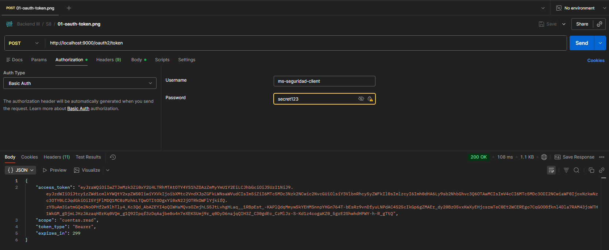

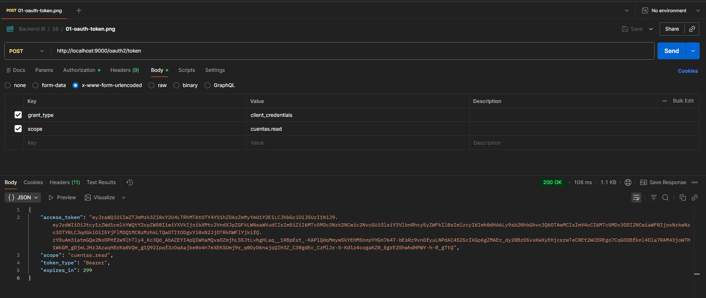

## Acceso autorizado

Endpoint protegido:

```text
GET http://localhost:8081/api/oauth2/cuentas
```

Utilizando un Bearer Token con el scope `cuentas.read`, el servidor permite el acceso.

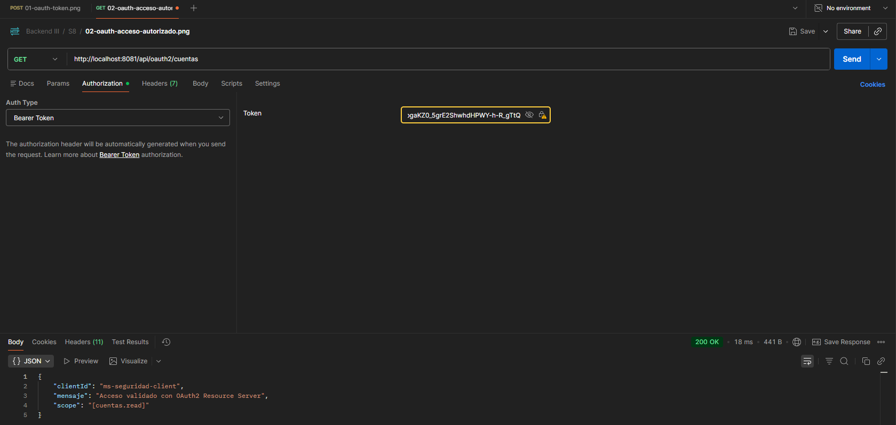

## Acceso sin autenticación

Una solicitud sin Bearer Token es rechazada con:

```text
401 Unauthorized
```

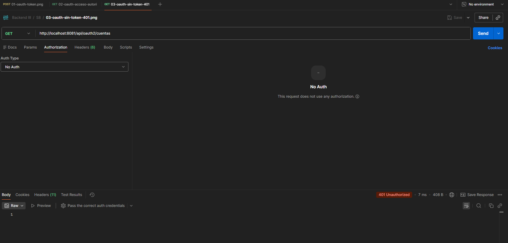

## Control de scopes

También se verificó el comportamiento de autorización mediante scopes.

Primero se genera un token sin solicitar `cuentas.read`.

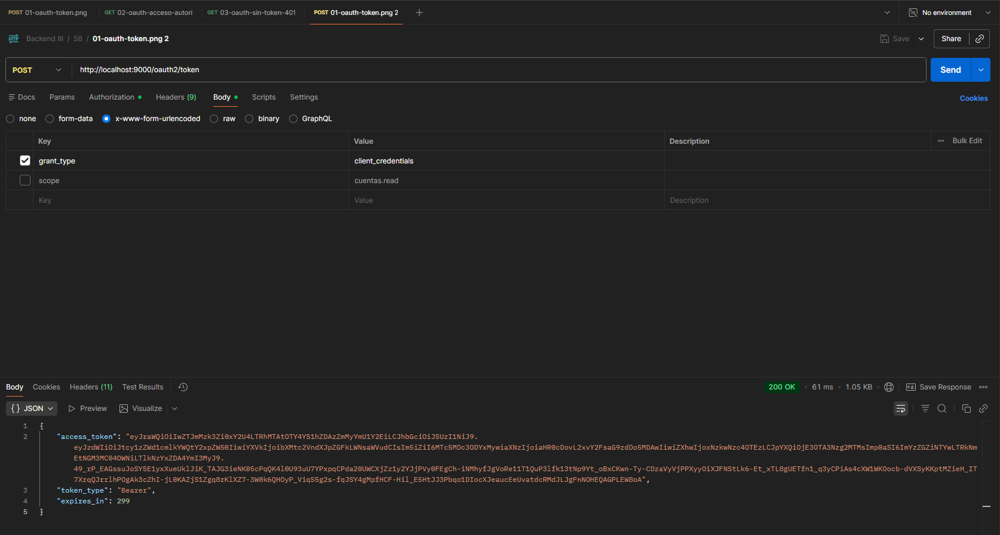

Al intentar acceder al recurso protegido utilizando ese token, el servidor responde:

```text
403 Forbidden
```

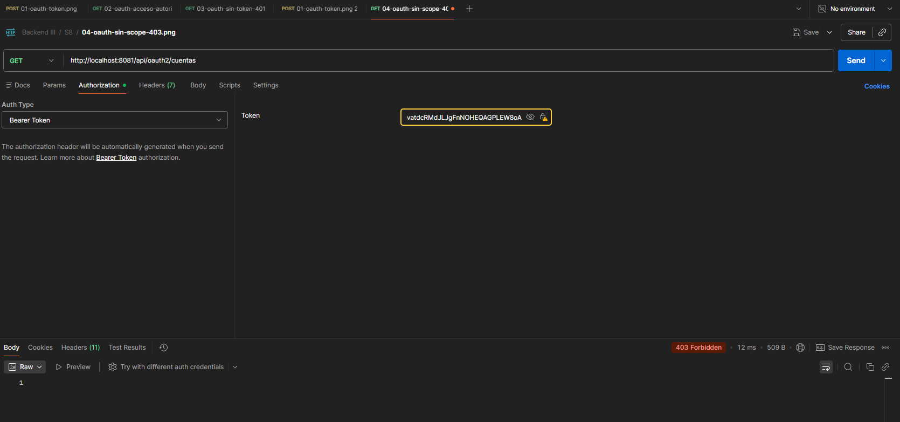

De esta forma se demuestra la diferencia entre autenticación y autorización dentro de la solución.

---

# Apache Kafka

La comunicación asíncrona para solicitudes de retiro utiliza Apache Kafka.

Se utilizan los siguientes topics:

```text
retiros-solicitados
retiros-aprobados
retiros-rechazados
```

Cada topic se configura con tres particiones.

El flujo de procesamiento es:

```text
BFF Cajeros
    |
    | retiros-solicitados
    v
Apache Kafka
    |
    v
Banco Central
    |
    | retiros-aprobados / retiros-rechazados
    v
Apache Kafka
    |
    v
BFF Cajeros
```

## Solicitud asíncrona de retiro

Endpoint:

```text
POST http://localhost:8082/bff-cajero/cuentas/137/retiros
```

Ejemplo:

```json
{
  "monto": 50000
}
```

La solicitud es recibida inmediatamente con:

```text
202 Accepted
```

y estado:

```text
PENDIENTE
```

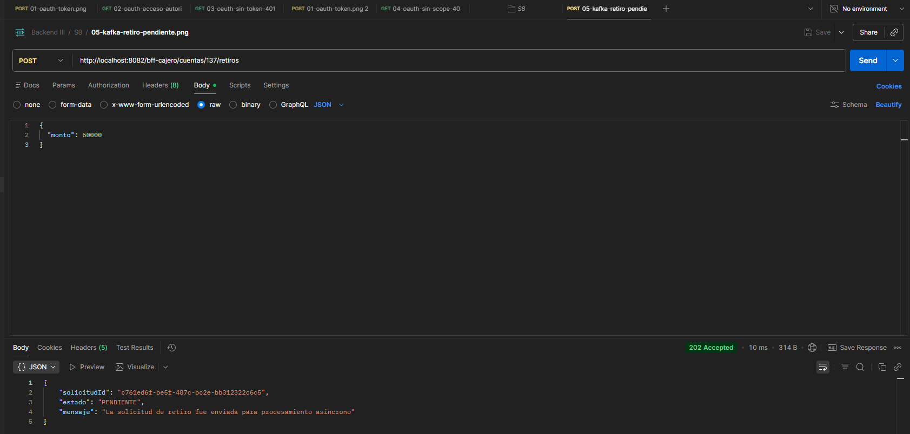

## Retiro aprobado

Luego de que Banco Central procesa el evento, publica el resultado correspondiente.

El BFF permite consultar el estado mediante:

```text
GET http://localhost:8082/bff-cajero/cuentas/retiros/{solicitudId}
```

Se verificó un retiro aprobado de `$50.000`, pasando de un saldo de `$450.000` a `$400.000`.

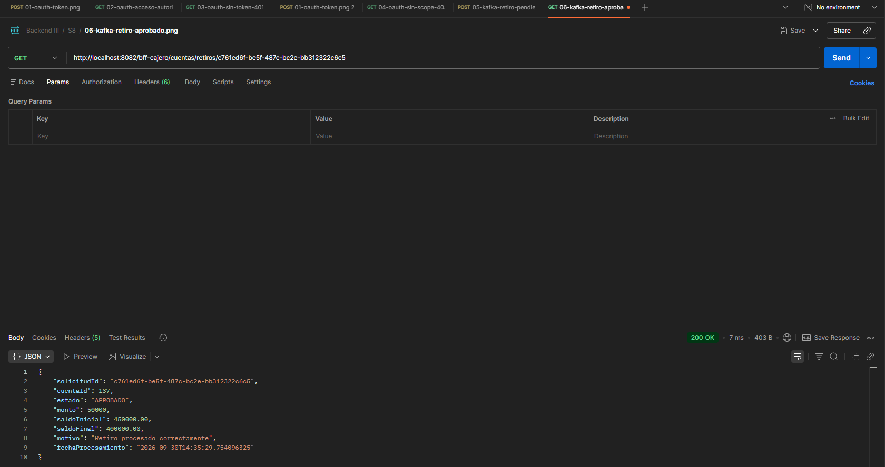

Esto demuestra que la solicitud:

1. fue publicada por BFF Cajeros;
2. fue consumida por Banco Central;
3. fue procesada;
4. generó un evento de resultado;
5. fue consumida nuevamente por BFF Cajeros.

## Retiro rechazado

También se probó un monto superior al saldo disponible.

La solicitud inicialmente es aceptada para procesamiento asíncrono:

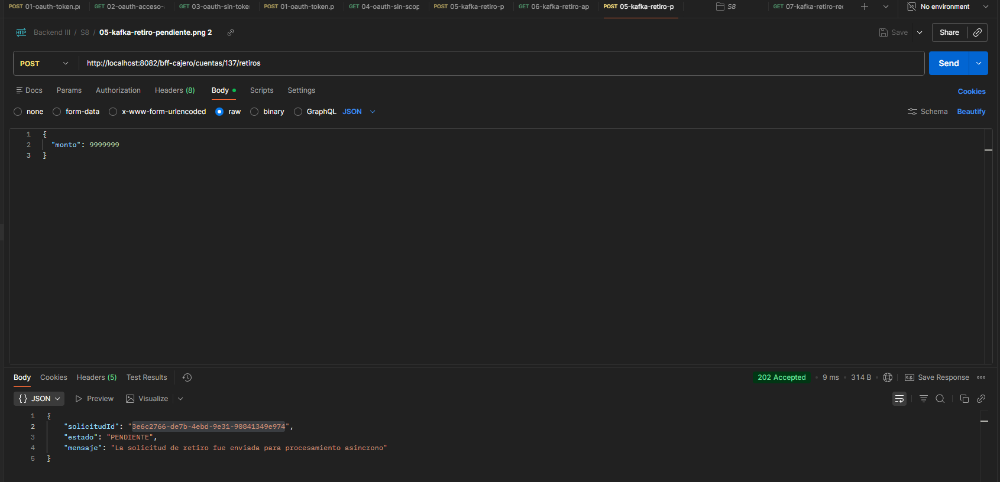

Posteriormente Banco Central devuelve el resultado:

```text
RECHAZADO
```

con el motivo:

```text
Fondos insuficientes para realizar esta operación
```

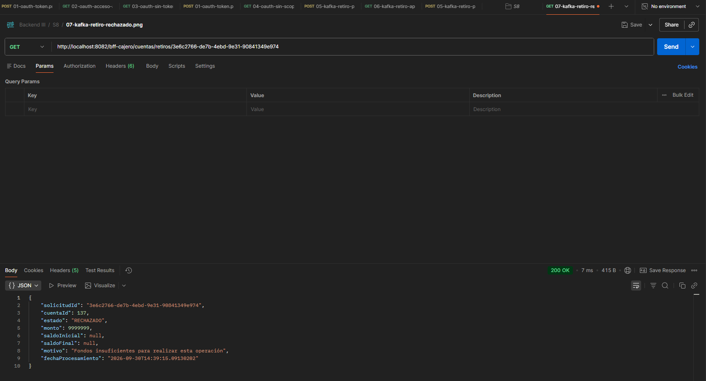

---

# Eureka Service Discovery

Los microservicios se registran en Eureka Server:

```text
http://localhost:8761
```

Se verificó el registro de:

```text
BFF-MOBILE
BFF-CAJEROS
BFF-WEB
BANCO-CENTRAL-XYZ
```

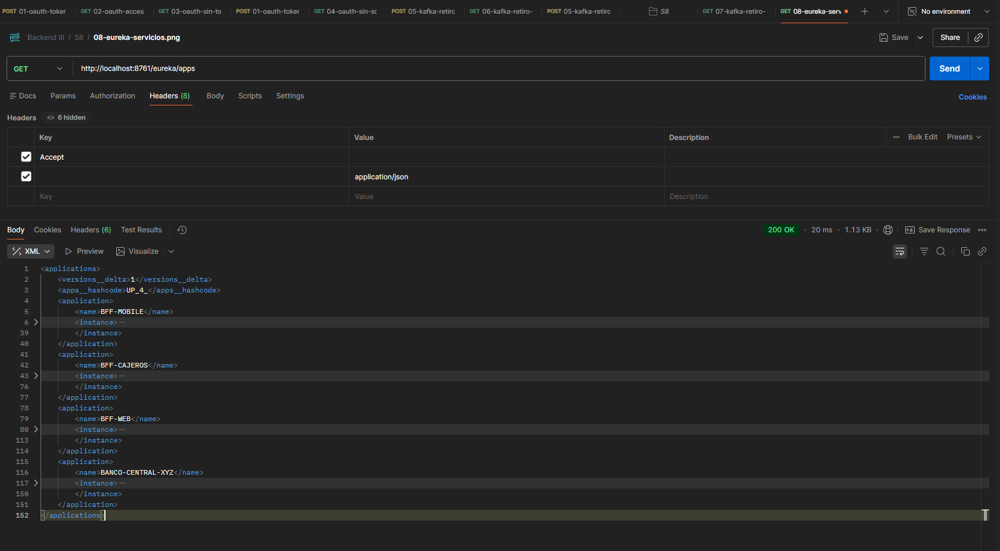

---

# Spring Cloud Config Server

La configuración centralizada se encuentra disponible mediante:

```text
http://localhost:8888
```

La configuración de Banco Central puede consultarse mediante:

```text
GET http://localhost:8888/banco-central-xyz/default
```

El Config Server utiliza el directorio:

```text
config-repo/
```

como repositorio de configuración.

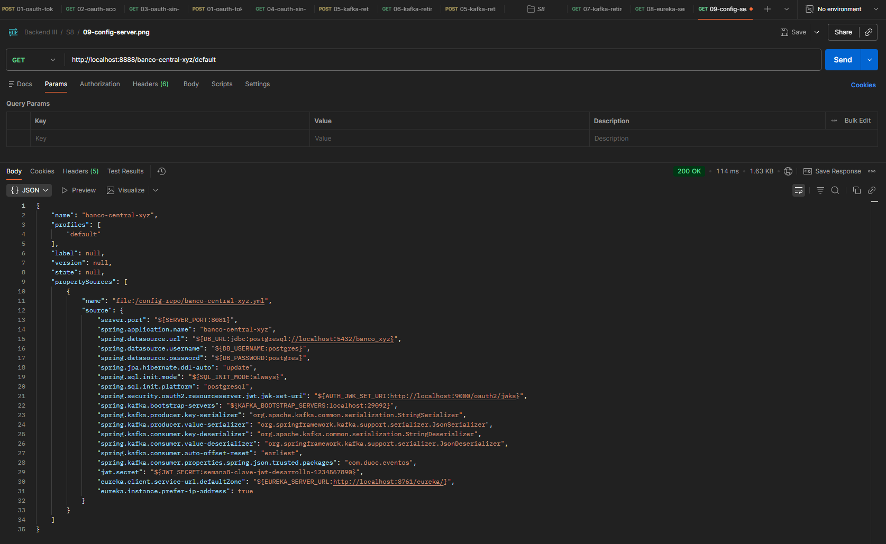

---

# Resilience4j

Los BFF utilizan Resilience4j para aumentar la tolerancia a fallos en las comunicaciones con Banco Central.

Se configuraron mecanismos como:

- Circuit Breaker
- Retry
- Rate Limiter
- Fallback

Para validar la resiliencia se detuvo temporalmente el servicio Banco Central:

```powershell
docker compose stop banco-central
```

Posteriormente se realizó una solicitud desde BFF Web:

```text
GET http://localhost:8084/bff-web/cuentas/137
```

En lugar de provocar una caída no controlada del BFF, la aplicación respondió:

```text
503 Service Unavailable
```

con un mensaje controlado:

```json
{
  "mensaje": "El servicio no está disponible en este momento. Intenta más tarde"
}
```

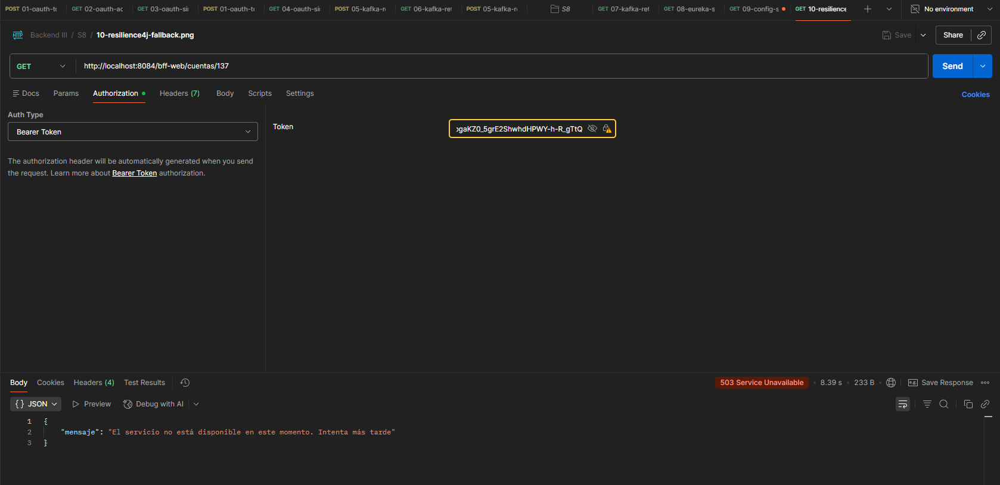

Finalmente el servicio se vuelve a iniciar mediante:

```powershell
docker compose start banco-central
```

---

# PostgreSQL

La base de datos se ejecuta mediante Docker utilizando PostgreSQL.

Base de datos:

```text
banco_xyz
```

Credenciales de desarrollo:

```text
Usuario: postgres
Contraseña: postgres
```

Las principales tablas son:

```text
cuentas_bancarias
movimientos_anuales
transacciones
usuarios
```

La comunicación entre Banco Central y PostgreSQL dentro de Docker utiliza:

```text
jdbc:postgresql://postgres:5432/banco_xyz
```

---

# Docker

Cada microservicio cuenta con su propio `Dockerfile`.

Los proyectos utilizan construcción multi-stage:

1. Maven compila la aplicación.
2. Se genera el archivo JAR.
3. Una imagen JRE ejecuta solamente el artefacto final.

Esto permite separar el entorno de compilación del entorno de ejecución.

---

# Docker Compose

El archivo `docker-compose.yml` permite levantar la arquitectura completa, incluyendo:

- PostgreSQL
- Zookeeper
- Kafka
- inicialización automática de topics
- Kafka UI
- Eureka Server
- Config Server
- Authorization Server
- Banco Central
- BFF Cajeros
- BFF Mobile
- BFF Web

Todos los servicios se comunican dentro de una red Docker denominada:

```text
banco-network
```

---

# Validaciones realizadas

Durante las pruebas se verificó:

- generación de token OAuth2;
- autenticación del cliente mediante Basic Auth;
- acceso autorizado mediante Bearer Token;
- rechazo de solicitudes sin token;
- rechazo de tokens sin scope requerido;
- registro de microservicios en Eureka;
- lectura de configuración mediante Spring Cloud Config;
- publicación de solicitudes de retiro en Kafka;
- procesamiento asíncrono de eventos;
- retiros aprobados;
- retiros rechazados;
- persistencia de cambios en PostgreSQL;
- comportamiento de fallback ante caída de Banco Central;
- construcción de todos los microservicios mediante Docker;
- orquestación de la arquitectura mediante Docker Compose.

---

# Evidencias

Las evidencias de ejecución se encuentran en:

```text
evidencias/
```

Estas capturas fueron obtenidas realizando pruebas reales contra los servicios desplegados mediante Docker Compose.

---

## Autor

Pedro Breit

Backend III  
Duoc UC
